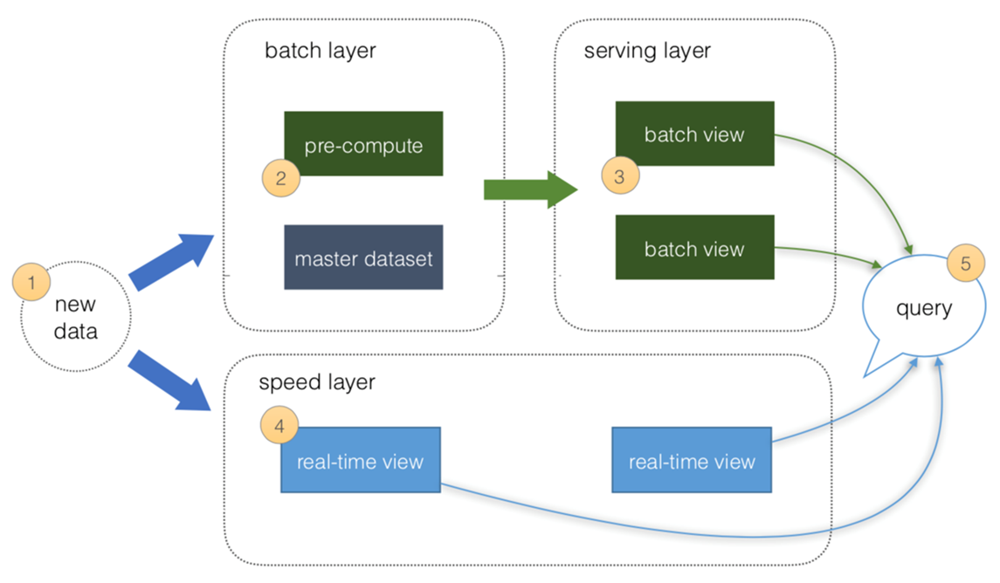
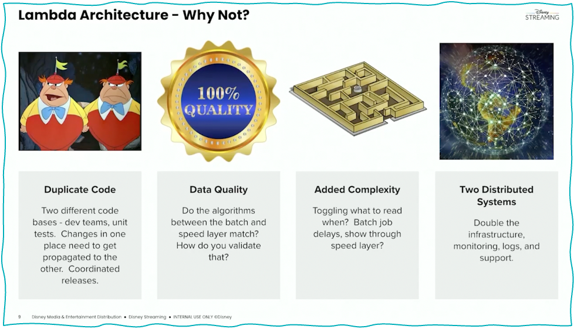
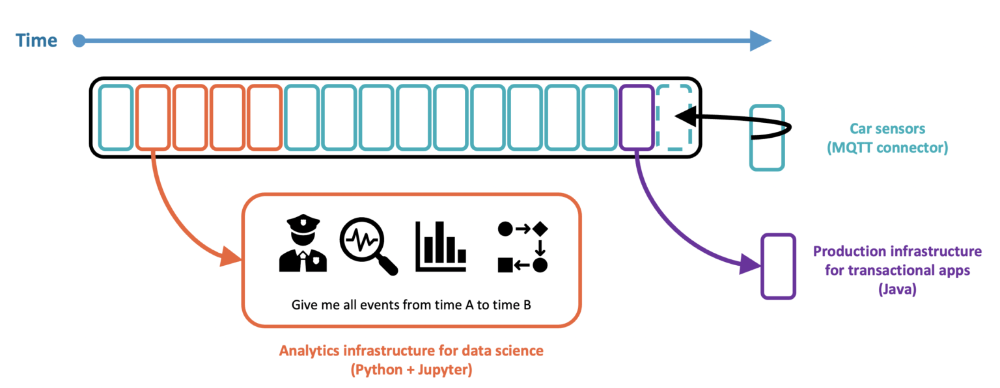
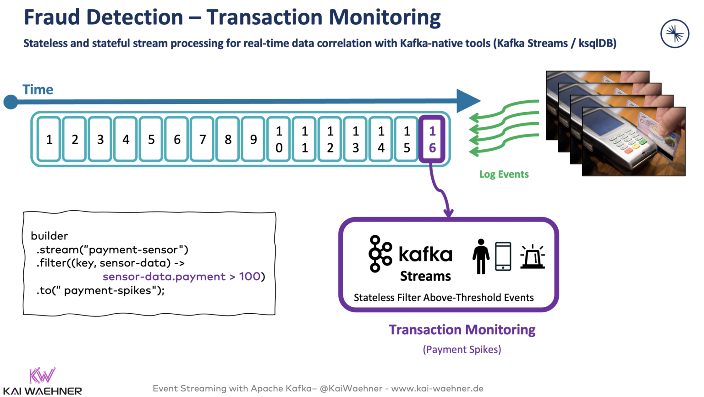
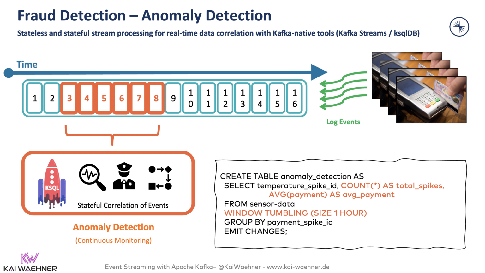
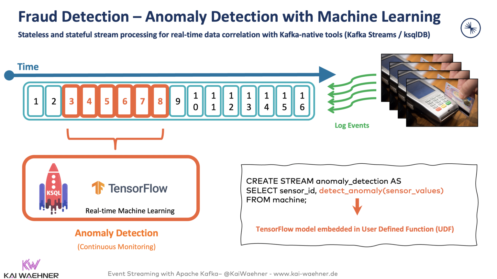

# Fraud Detection with Kafka

Fraud detection becomes increasingly challenging in a digital world across all industries. Real-time data processing with Apache Kafka has become the de facto standard to correlate and prevent fraud continuously before it happens. 

# Lambda vs Kappa Architecture

**Data at Rest** means data stored in a database, data warehouse, or data lake. 
We could have a real-time streaming component like Kafka ingesting the data, but the data processing is still a web service call, SQL query, or map-reduce batch process.

This is not a bad thing, we have various use-cases like reporting, analytics and model training, which work very well with this approach.
However, for use cases like fraud detection, we need a **Real-time** approach 

## Lambda Architecture

Nathan Marz coined the Lambda architecture: A data-processing architecture designed to handle massive quantities of data by taking advantage of both batch and stream-processing methods

Lambda architecture includes **batch, speed, and serving layers**. This approach enables processing data in real-time but also easy re-processing of batched static datasets. The problem with out-of-order data is also solved.

### Issues with the Lambda Architecture

Disney has summarized the concerns with the Lambda architecture on one slide:

The batch and streaming sides each require 
1. a different codebase that must be maintained and kept in sync so that processed data produces the same result from both paths. 
2. Additionally, everything needs to be processed (at least) twice. 
3. That increases the cost and operations efforts of storage, network, and compute.

## Kappa Architecture

The Kappa architecture is a software architecture that is event-based and able to handle all data at all scale in real-time for transactional AND analytical workloads.

The central premise behind the Kappa architecture is that you can perform both **real-time and batch processing with a single technology stack**. The heart of the infrastructure is **streaming architecture**. First, the event streaming platform log stores incoming data. From there, a stream processing engine processes the data continuously in real-time or ingests the data into any other analytics database or business application via any communication paradigm and speed, including real-time, near real-time, batch, request-response.

Unlike the Lambda Architecture, in this approach, you only do re-processing when your processing code changes, and you need to recompute your results. And, of course, the job doing the re-computation is just an improved version of the same code, running on the same framework, taking the same input data.

To summarize,  
Kappa Architecture is a **simplification of the Lambda Architecture** system with **the absence of batch processing**. It has the same basic goals as the Lambda architecture, but with an important distinction: **all data flows through a single path, using a stream processing system.**

# Fraud Detection using Stream Processing in payments

**Stream processing is the foundation for implementing fraud detection and prevention** while the data is in motion (and relevant) instead of just storing data at rest for analytics (too late).

Lets look at some examples

1. Stateless transaction monitoring with Kafka Streams

2. Stateful anomaly detection with Kafka and KSQL

A ksqlDB application, written with SQL code, continuously analyses the transactions of the last hour per customer ID to identify malicious behavior:

3. Machine Learning with TensorFlow for real-time scoring for fraud detection

A KQL UDF (user-defined function) embeds an analytic model trained with TensorFlow for real-time fraud prevention:

